# PostgreSQL Setup Locally

## Pre-requisite
C4WX1 Database in MSSQL is up to date.

## Setting up PostgreSQL Server
1. Download latest [PostgreSQL server](https://www.enterprisedb.com/downloads/postgres-postgresql-downloads) (Current latest is v17.2 as of Jan 2025)
2. Follow installation steps:
    1. Use default settings for all steps
    2. When prompted to type password for postgresql database superuser (it is usually postgres), provide one for the superuser. It can be anything u like but remember this password.!
    [alt text](password-setup.png)
    3. Use port 5432 (this is default postgresql server port) for any incoming database connection
    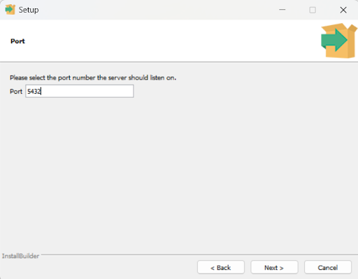
    4. Use “[Default Locale]” for the database locale
    5. Review settings, and wait for the installation to be completed.
    6. Once the installation is done, uncheck “Launch Stack Builder at exit” as we do not need this component.
    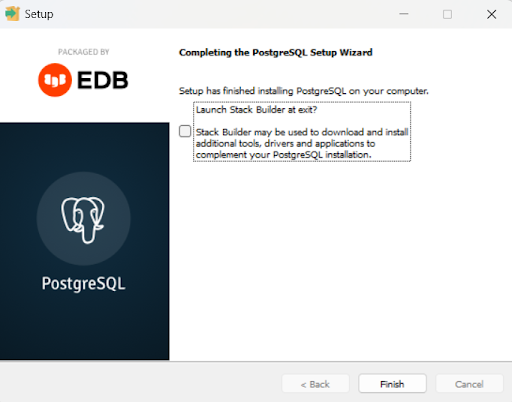
    7. Verify that Postgresql server is running in Services
    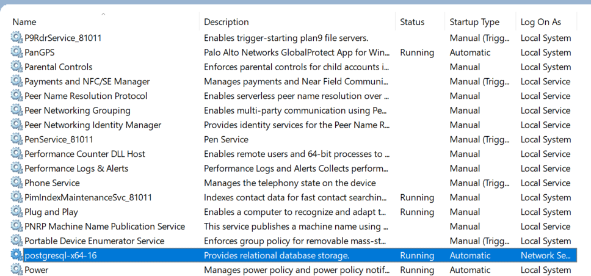

## Setting up PgAdmin 4
1. Download latest version of 64-bit Windows installer for [PgAdmin 4](https://www.pgadmin.org/download/pgadmin-4-windows/) (Current latest is v8.14 as of Jan 2025).
2. Use default settings for all steps, review settings and wait for installation to be completed.

## Creating New Postgresql Server
1. Open PgAdmin4
2. Right click on “Servers” > “Register” > “Server”
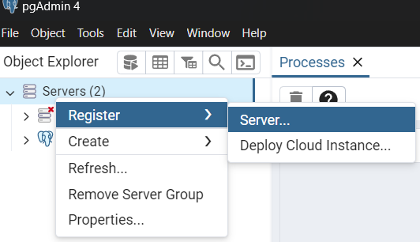
3. Configure the new server for C4WX1
    1. “General” tab 
        - Provide a name for the server
    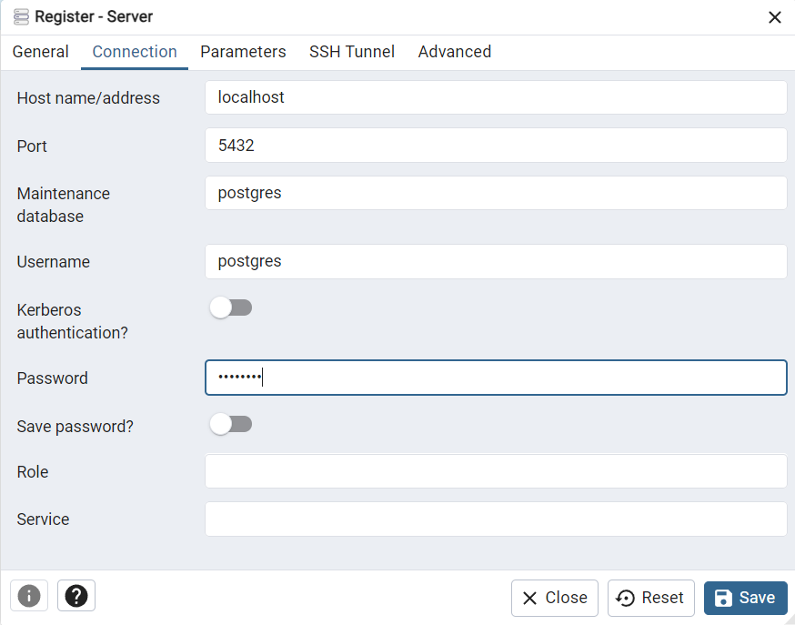
    2. “Connection” tab
        - “Host name/address” - localhost
        - “Port” - 5432 (default)
        - “Username” - postgres (default, superuser)
        - “Password” - superuser password as configured
    
    3. Confirm settings and “Save”, then verify the connection to the created server, it should display list of Databases and so on.
    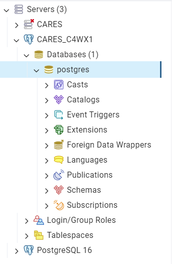

## [Optional] Creating New Postgresql User
1. To avoid using superuser credentials to login to the database server, we can create a new user for the login with CRUD access.
2. After connecting to the server, right click on “Login/Group Roles” > “Create” > “Login/Group Role…”
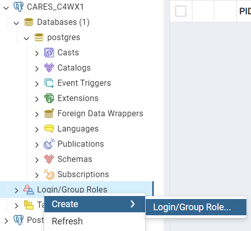
3. Configure the new user
    1. “General” tab - Provide Name and Comments (optional)
    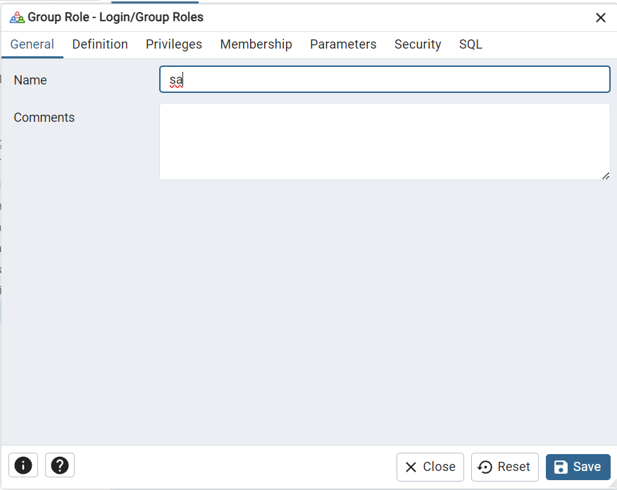
    2. “Definition” tab - Provide Password and leave others as default
    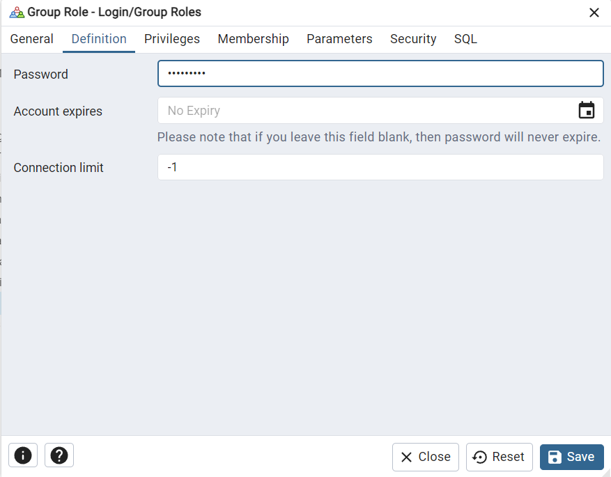
    3. “Privileges” tab - Make sure “Can login?” and “Create databases?” are checked, the rest can leave it as default
    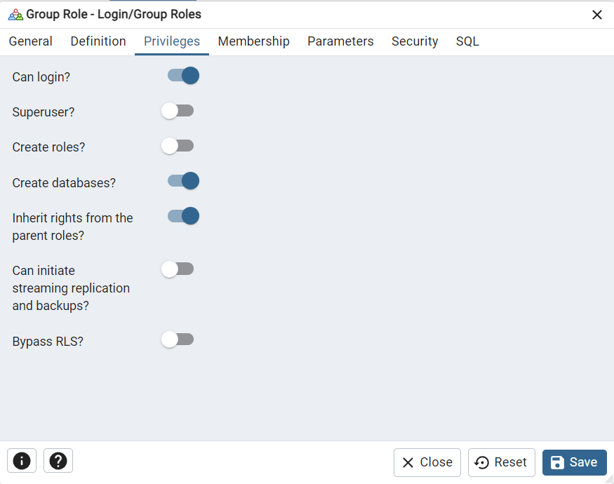
    4. “Membership” tab - Add the following “User/Role” with “With Admin” checked for each.
        - pg_read_all_data
        - pg_write_all_data
    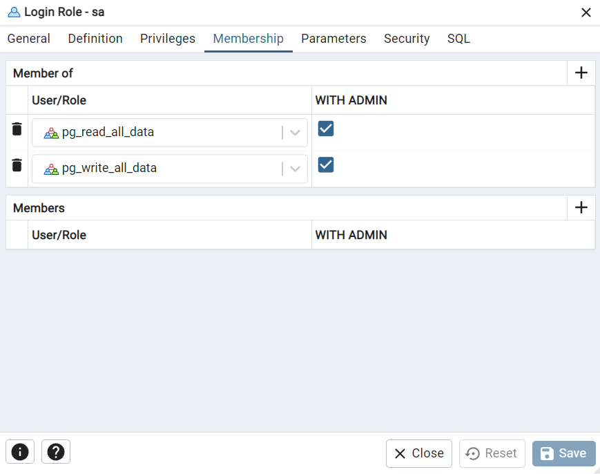
    5. Confirm settings and “Save”, then verify the user is created in the server
    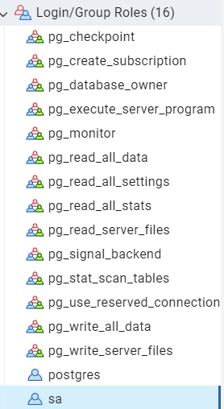

## Creating New Postgresql Database
1. After connecting to the server, right click on “Databases” > “Create” > “Database…”
2. Configure the new database
    1. “General” tab - Provide Name and leave the rest as default
    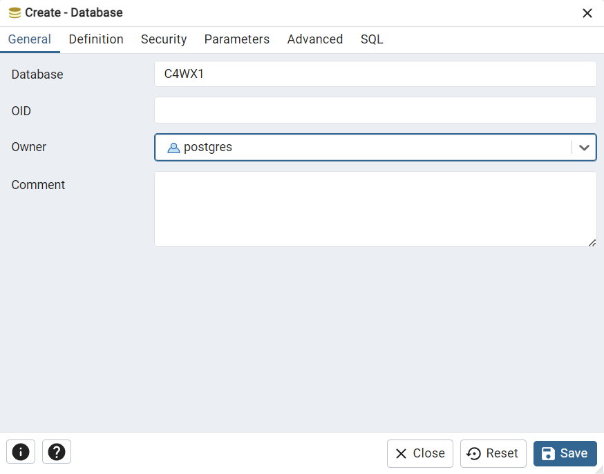
    2. Confirm settings and “Save”
