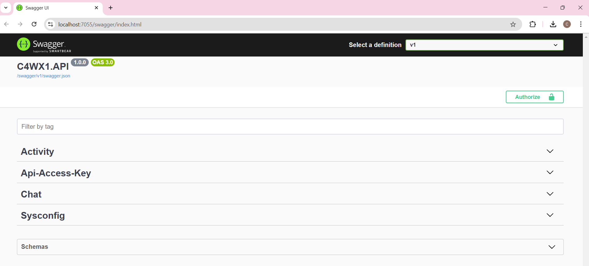

# Start C4WX1 API Server

1. Open the solution, right click on `C4WX1.API` project > "Set as startup project"
2. Run `C4WX1.API` project using https port. Swagger UI is available to try out the APIs that are created.
