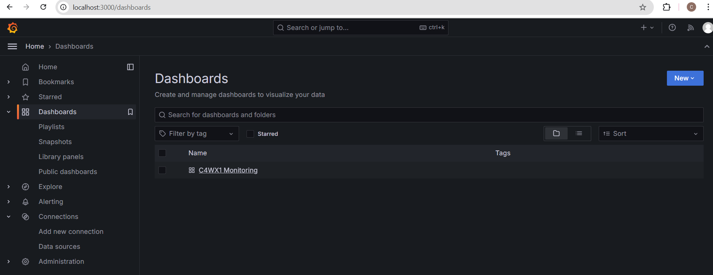

# Monitoring C4WX1 API

## Pre-requisite:
- Docker
- Docker Compose
- Docker Desktop

## Setting Up Monitoring for C4WX1 API
1. Navigate to `/docker` and run `docker-compose up -d`
2. 2 containers will be created under `c4wx1` group:
    - Prometheus
    - Grafana
3. Navigate to `localhost:3000` by using login: `admin` for both username and password.
4. Navigate to `Dashboards` and there will be a pre-created Grafana dashboard named `C4WX1 Monitoring`:

5. Currently it's tracking average number of HTTP Requests received over 5 minutes. 